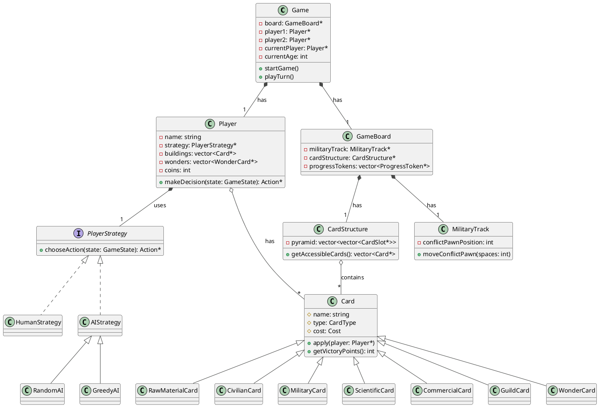

# 7 Wonders Duel C++ 实现思路与架构

## 1. 核心设计理念

本项目采用**面向对象编程 (OOP)** 作为核心设计理念,旨在将复杂的桌游规则分解为一系列清晰、独立且可复用的模块。主要目标是实现**高内聚、低耦合**的设计,使得代码易于理解、维护和扩展。

### 主要设计原则:

- **单一职责原则**: 每个类只负责一项功能,例如 `Card` 类只关心卡牌自身属性,而 `Player` 类负责管理玩家状态。
- **开闭原则**: 系统对扩展开放,对修改关闭。通过使用策略模式 (`PlayerStrategy`) 和工厂模式 (`CardFactory`),可以在不修改核心代码的情况下添加新的AI行为或卡牌。
- **接口隔离原则**: 将复杂的接口拆分为更小、更具体的接口,例如 `PlayerStrategy` 定义了所有玩家决策的统一接口。

## 2. UML 架构图

以下是项目的核心类图,展示了主要类之间的关系:

*(这是一个简化的UML图,展示了核心关系。)*

## 3. 关键模块详解

### 3.1 卡牌系统 (`Card` & `CardFactory`)

- **`Card` 基类**: 定义了所有卡牌的通用接口,如 `apply()` (应用效果) 和 `getVictoryPoints()`。这是一个抽象基类,所有具体卡牌都继承自它。
- **具体卡牌子类**: 如 `MilitaryCard`, `ScientificCard` 等,各自实现了特定的效果和计分逻辑。
- **`CardFactory`**: 采用**工厂模式**,负责创建所有时代的卡牌、奇迹和公会卡。将卡牌的创建逻辑集中管理,使得卡牌数据易于修改,且与游戏主逻辑分离。

### 3.2 玩家与AI策略 (`Player` & `PlayerStrategy`)

- **`Player` 类**: 管理玩家的所有状态,包括金币、建筑、奇迹、军事力量和科学符号。
- **`PlayerStrategy` 接口**: 采用**策略模式**,将玩家的决策逻辑从 `Player` 类中分离出来。这使得我们可以轻松地切换人类玩家和不同类型的AI。
- **`HumanStrategy`**: 代表人类玩家,其决策通过 `InputHandler` 从控制台获取。
- **`AIStrategy`**: AI策略的基类,提供了评估卡牌价值的通用方法。`RandomAI` 和 `GreedyAI` 继承自它,实现了不同的决策算法。

### 3.3 游戏板与游戏流程 (`GameBoard` & `Game`)

- **`GameBoard`**: 聚合了游戏的所有公共组件,包括 `MilitaryTrack` (军事轨道) 和 `CardStructure` (金字塔结构)。
- **`CardStructure`**: 负责管理每个时代的金字塔卡牌布局,并计算哪些卡牌是可访问的。
- **`MilitaryTrack`**: 追踪冲突棋子的位置,并处理军事标记触发的效果。
- **`Game` 类**: 作为游戏的主控制器,负责管理游戏流程,包括时代更替、玩家轮换、执行行动和检查胜利条件。

## 4. 胜利条件

胜利条件的判断被封装在 `VictoryCondition` 类中,主要有三种胜利方式:

1.  **军事胜利**: 当冲突棋子到达对手的首都时立即获胜。
2.  **科技胜利**: 当一名玩家集齐6种不同的科学符号时立即获胜。
3.  **平民胜利 (计分)**: 如果游戏进行到第三时代结束仍未分出胜负,则通过计算胜利点数决定胜者。点数来源包括建筑、奇迹、进度标记、金币和军事优势。

## 5. 待改进之处

- **更复杂的AI**: 当前的贪心AI只考虑了当前回合的最佳选择,可以引入更高级的算法,如Minimax或蒙特卡洛树搜索,来预测未来几步的局势。
- **图形用户界面 (GUI)**: 当前的控制台界面功能有限,未来可以替换为图形界面(如使用Qt或SFML库),以提供更好的视觉体验。
- **扩展包支持**: 当前只实现了基础游戏,可以通过扩展 `CardFactory` 和游戏逻辑来支持《万神殿》等扩展包。
